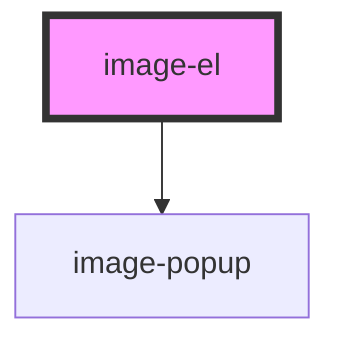

# image-el

<!-- Auto Generated Below -->

## Properties

| Property    | Attribute    | Description | Type     | Default     |
| ----------- | ------------ | ----------- | -------- | ----------- |
| `elementId` | `element-id` |             | `string` | `undefined` |
| `imgAlt`    | `img-alt`    |             | `string` | `undefined` |
| `imgSrc`    | `img-src`    |             | `string` | `undefined` |

## Events

| Event          | Description | Type                                                                                        |
| -------------- | ----------- | ------------------------------------------------------------------------------------------- |
| `passToModule` |             | `CustomEvent<{ id: number; name: string; details: string; price: number; image: string; }>` |

## Dependencies

### Depends on

- [image-popup](../image-popup)

### Graph

----------------------------------------------

*Built with [StencilJS](https://stenciljs.com/)*
