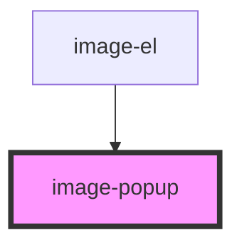

# image-popup

<!-- Auto Generated Below -->

## Properties

| Property        | Attribute | Description | Type                                                                           | Default     |
| --------------- | --------- | ----------- | ------------------------------------------------------------------------------ | ----------- |
| `moduleDataObj` | --        |             | `{ id: number; name: string; details: string; price: number; image: string; }` | `undefined` |

## Events

| Event             | Description | Type               |
| ----------------- | ----------- | ------------------ |
| `triggerFunction` |             | `CustomEvent<any>` |

## Dependencies

### Used by

 - [image-el](../image-el)

### Graph

----------------------------------------------

*Built with [StencilJS](https://stenciljs.com/)*
